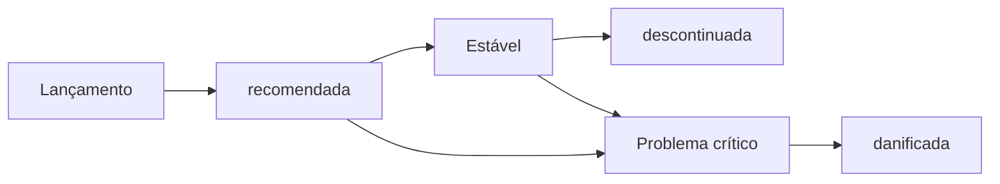

# Política de ciclo de vida

Este portal traduz as releases técnicas em **contexto operacional**: o estado de cada versão, o impacto descrito da atualização e a compatibilidade entre placa principal (Main) e tela (IHM). A decisão de atualizar ou não fica com a operação.

## Fluxo de vida de uma versão

## Status operacionais

Cada status descreve o **estado atual** da versão. A decisão de instalar, manter ou trocar fica com a operação, com base nesse contexto.

<table class="definitions-table">
  <thead>
    <tr><th>Status</th><th>Estado da versão</th></tr>
  </thead>
  <tbody>
    <tr>
      <td></td>
      <td>Versão de referência no momento: validada para produção, alinhada ao parque atual e indicada pela engenharia para novas instalações e atualizações de rotina.</td>
    </tr>
    <tr>
      <td></td>
      <td>Versão sem bug conhecido específico dela e ainda aceitável em produção, mas já não é a referência geral — existe uma Recomendada mais recente, ou ela só faz sentido para um modelo, tipo de máquina ou cliente específico.</td>
    </tr>
    <tr>
      <td></td>
      <td>Versão com problema crítico identificado. Máquinas nessa versão estão expostas a falha relevante e a engenharia sinaliza risco operacional.</td>
    </tr>
    <tr>
      <td></td>
      <td>Versão fora do ciclo operacional: não recebe mais suporte ativo e não faz parte do conjunto indicado para o parque atual.</td>
    </tr>
  </tbody>
</table>

### Resumo rápido

1. **Recomendada** — referência atual da engenharia (validada, alinhada ao parque, indicada para novas instalações e atualizações).
2. **Estável** — sem problema conhecido específico dela; já há uma referência mais nova, ou só é útil para um modelo, tipo de máquina ou cliente específico.
3. **Danificada** — problema crítico conhecido; risco operacional nessa versão.
4. **Descontinuada** — fora de suporte e fora do conjunto indicado para o parque.

## Níveis de impacto da atualização

<table class="definitions-table">
  <thead>
    <tr><th>Impacto</th><th>Significado</th></tr>
  </thead>
  <tbody>
    <tr>
      <td></td>
      <td>Atualização não traz benefício relevante para a maioria do parque.</td>
    </tr>
    <tr>
      <td></td>
      <td>Atualização desejável para novas instalações e máquinas em expansão.</td>
    </tr>
    <tr>
      <td></td>
      <td>Benefício limitado a um grupo de máquinas (hardware, região ou fluxo).</td>
    </tr>
    <tr>
      <td></td>
      <td>Atualização necessária por mudança incompatível com a versão anterior ou por requisito de segurança.</td>
    </tr>
  </tbody>
</table>

## Regras de negócio

- **Status descreve estado, não ordem** — o portal informa o contexto da versão; a operação decide com base nisso e no cenário da máquina.
- **O portal informa, não decide** — o banner e o status descrevem o estado da versão; a operação decide no cenário de cada máquina.
- **Compatibilidade cruzada Main ↔ IHM** — consulte a [tabela de compatibilidade]({{ '/releases/compatibility/' | relative_url }}) antes de combinar versões da placa e da tela.
- **Conteúdo preliminar** — alguns campos podem estar provisórios até validação pela equipe; em caso de dúvida, confirme com a engenharia.
