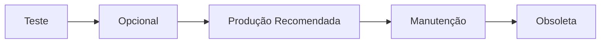

# Política de ciclo de vida

Este portal traduz releases técnicas em **decisões operacionais**: o que pode ir para produção, o que está obsoleto e quando vale atualizar.

## Fluxo de vida de uma versão

1. **Teste** — versão em validação; nunca deploy em produção.
2. **Opcional** — pode ser instalada, mas não é a referência.
3. **Produção Recomendada** — versão de referência para novas instalações.
4. **Manutenção** — ainda suportada, mas uma versão mais nova é preferível.
5. **Obsoleta** — não instalar; evitar em máquinas novas.

## Status operacionais

<table class="definitions-table">
  <thead>
    <tr><th>Status</th><th>Significado</th><th>Pode instalar?</th></tr>
  </thead>
  <tbody>
    <tr>
      <td></td>
      <td>Em validação interna ou piloto controlado.</td>
      <td>Apenas ambiente de teste (<code>test_only: true</code>).</td>
    </tr>
    <tr>
      <td></td>
      <td>Release válida, mas não é a referência atual.</td>
      <td>Sim, se atender requisitos de hardware.</td>
    </tr>
    <tr>
      <td></td>
      <td>Versão de referência para produção.</td>
      <td>Sim — preferida para novas máquinas.</td>
    </tr>
    <tr>
      <td></td>
      <td>Ainda suportada; versão mais nova disponível.</td>
      <td>Sim, mas planeje migração.</td>
    </tr>
    <tr>
      <td></td>
      <td>Fora de suporte operacional.</td>
      <td><strong>Não</strong> em instalações novas.</td>
    </tr>
  </tbody>
</table>

## Níveis de impacto da atualização

<table class="definitions-table">
  <thead>
    <tr><th>Impacto</th><th>Significado</th></tr>
  </thead>
  <tbody>
    <tr>
      <td></td>
      <td>Atualização não traz benefício relevante para a maioria do parque.</td>
    </tr>
    <tr>
      <td></td>
      <td>Atualização desejável para novas instalações e máquinas em expansão.</td>
    </tr>
    <tr>
      <td></td>
      <td>Benefício limitado a um grupo de máquinas (hardware, região, fluxo).</td>
    </tr>
    <tr>
      <td></td>
      <td>Atualização necessária por breaking change ou requisito de segurança.</td>
    </tr>
  </tbody>
</table>

## Regras de negócio

- **Versão em teste nunca vai para produção** — o campo `deploy: test` ou `test_only: true` deve estar visível no dashboard.
- **Obsoleta = não instalar** — nem em manutenção corretiva, salvo exceção documentada pela engenharia.
- **"Devo atualizar?" prevalece** — o banner no topo de cada versão é a orientação operacional; o CHANGELOG técnico complementa.
- **Compatibilidade cruzada Main ↔ IHM** — consulte a [tabela de compatibilidade]({{ '/releases/compatibility/' | relative_url }}) antes de combinar versões.
- **Conteúdo preliminar** — campos de política podem ser placeholder até validação pela equipe; sinalize dúvidas à engenharia.

## Processo ao publicar nova versão

1. Criar arquivo Markdown em `_rbx01_versions/` ou `_ihm_versions/`.
2. Preencher `should_update` em linguagem de negócio.
3. Rebaixar status da versão anterior (ex.: recommended → maintenance).
4. Atualizar `_data/cross-compat.yml` se a combinação Main+IHM mudar.
5. Abrir PR usando o checklist em `.github/PULL_REQUEST_TEMPLATE/new-release.md`.
