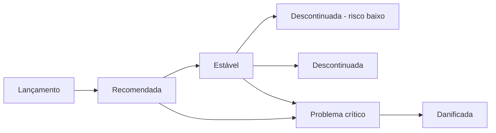
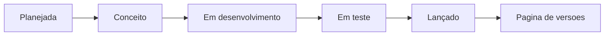

# Política de ciclo de vida

Este portal traduz as releases técnicas em **contexto operacional**: o estado de cada versão, o impacto descrito da atualização e a compatibilidade entre placa principal (Main) e tela (IHM). A decisão de atualizar ou não fica com a operação.

## Fluxo de vida de uma versão

```mermaid
flowchart LR
    lancamento[Lançamento] --> recomendada[Recomendada]
    recomendada --> estavel[Estável]
    estavel --> riscoBaixo[Descontinuada - risco baixo]
    estavel --> descontinuada[Descontinuada]
    recomendada --> problemaCritico[Problema crítico]
    estavel --> problemaCritico
    problemaCritico --> danificada[Danificada]
```

## Status operacionais

Cada status descreve o **estado atual** da versão. A decisão de instalar, manter ou trocar fica com a operação, com base nesse contexto.

<table class="definitions-table">
  <thead>
    <tr><th>Status</th><th>Estado da versão</th></tr>
  </thead>
  <tbody>
    <tr>
      <td></td>
      <td>Versão de referência no momento: validada para produção, alinhada ao parque atual e indicada pela engenharia para novas instalações e atualizações de rotina.</td>
    </tr>
    <tr>
      <td></td>
      <td>Versão sem bug conhecido específico dela e ainda aceitável em produção, mas já não é a referência geral — existe uma Recomendada mais recente, ou ela só faz sentido para um modelo, tipo de máquina ou cliente específico.</td>
    </tr>
    <tr>
      <td></td>
      <td>Versão com problema crítico identificado. Máquinas nessa versão estão expostas a falha relevante e a engenharia sinaliza risco operacional.</td>
    </tr>
    <tr>
      <td></td>
      <td>Versão fora do ciclo operacional: não recebe mais suporte ativo e não faz parte do conjunto indicado para o parque atual.</td>
    </tr>
    <tr>
      <td></td>
      <td><strong>Sub-categoria de Descontinuada.</strong> Saiu do ciclo porque existe uma versão mais nova, não por falha grave: era uma versão estável e os problemas conhecidos dela são de risco baixo. Não faz parte do conjunto indicado para o parque atual, mas voltar para ela é aceitável se o cenário da máquina exigir. Confira a seção “Bugs conhecidos” da versão antes de decidir.</td>
    </tr>
  </tbody>
</table>

### Resumo rápido

1. **Recomendada** — referência atual da engenharia (validada, alinhada ao parque, indicada para novas instalações e atualizações).
2. **Estável** — sem problema conhecido específico dela; já há uma referência mais nova, ou só é útil para um modelo, tipo de máquina ou cliente específico.
3. **Danificada** — problema crítico conhecido; risco operacional nessa versão.
4. **Descontinuada** — fora de suporte e fora do conjunto indicado para o parque.
5. **Descontinuada + Risco baixo** — fora do conjunto indicado, mas saiu por existir uma mais nova e não por falha grave; é aceitável voltar para ela.

## Status do roadmap (aba Futuro)

O firmware é planejado em **lançamentos semestrais**: cada semestre concentra um conjunto de features e resulta em uma versão. Os semestres ficam em [Futuro]({{ '/releases/futuro/' | relative_url }}). Quando o semestre é lançado, ele passa a `Lançado` com o número da versão, e essa versão aparece nas páginas de versões (Main / IHM) com um status operacional (`recomendada`, `estavel`, etc.).

```mermaid
flowchart LR
    planejada[Planejada] --> conceito[Conceito]
    conceito --> desenvolvimento[Em desenvolvimento]
    desenvolvimento --> teste[Em teste]
    teste --> lancado[Lançado]
    lancado --> versoes[Pagina de versoes]
```

<table class="definitions-table">
  <thead>
    <tr><th>Status</th><th>O que significa para a operação</th></tr>
  </thead>
  <tbody>
    <tr>
      <td></td>
      <td>Semestre reservado no roadmap. Ainda não há escopo nem data firme — não espere nada em campo nesse período.</td>
    </tr>
    <tr>
      <td></td>
      <td>Engenharia está definindo o que entra no semestre (ideias e escopo). Nada para instalar; mudanças de plano são esperadas.</td>
    </tr>
    <tr>
      <td></td>
      <td>Features do semestre sendo implementadas. Pode haver builds internos, mas não é versão de teste em campo nem de produção.</td>
    </tr>
    <tr>
      <td></td>
      <td>Conjunto sob validação (lab ou campo). Consulte a seção “Testes em andamento” no Futuro. Só a engenharia libera o uso; ao encerrar o teste, a operação pode ser orientada a retirar essas builds da rua.</td>
    </tr>
    <tr>
      <td></td>
      <td>O semestre foi fechado e a versão saiu. Consulte a página da versão (Main / IHM) para status operacional, impacto e compatibilidade.</td>
    </tr>
  </tbody>
</table>

### Resumo rápido (roadmap)

1. **Planejada** — semestre reservado; sem trabalho ativo.
2. **Conceito** — escopo em definição.
3. **Em desenvolvimento** — implementação em andamento.
4. **Em teste** — validação; acompanhe datas e conjuntos na aba Futuro.
5. **Lançado** — versão definida e publicada na lista oficial de versões.

## Níveis de impacto da atualização

<table class="definitions-table">
  <thead>
    <tr><th>Impacto</th><th>Significado</th></tr>
  </thead>
  <tbody>
    <tr>
      <td></td>
      <td>Atualização não traz benefício relevante para a maioria do parque.</td>
    </tr>
    <tr>
      <td></td>
      <td>Atualização desejável para novas instalações e máquinas em expansão.</td>
    </tr>
    <tr>
      <td></td>
      <td>Benefício limitado a um grupo de máquinas (hardware, região ou fluxo).</td>
    </tr>
    <tr>
      <td></td>
      <td>Atualização necessária por mudança incompatível com a versão anterior ou por requisito de segurança.</td>
    </tr>
  </tbody>
</table>

## Regras de negócio

- **Status descreve estado, não ordem** — o portal informa o contexto da versão; a operação decide com base nisso e no cenário da máquina.
- **Descontinuada não é sinônimo de risco alto** — o selo `Risco baixo` separa a versão que saiu do ciclo por ter uma sucessora da versão que saiu sem essa garantia. Só a primeira é candidata a retorno, e mesmo nela vale ler os bugs conhecidos antes.
- **O portal informa, não decide** — o banner e o status descrevem o estado da versão; a operação decide no cenário de cada máquina.
- **Compatibilidade cruzada Main ↔ IHM** — consulte a [tabela de compatibilidade]({{ '/releases/compatibility/' | relative_url }}) antes de combinar versões da placa e da tela.
- **Roadmap ≠ produção** — semestres em [Futuro]({{ '/releases/futuro/' | relative_url }}) não são versões instaláveis; só entram no parque após o lançamento nas páginas de versões.
- **Conteúdo preliminar** — alguns campos podem estar provisórios até validação pela equipe; em caso de dúvida, confirme com a engenharia.
